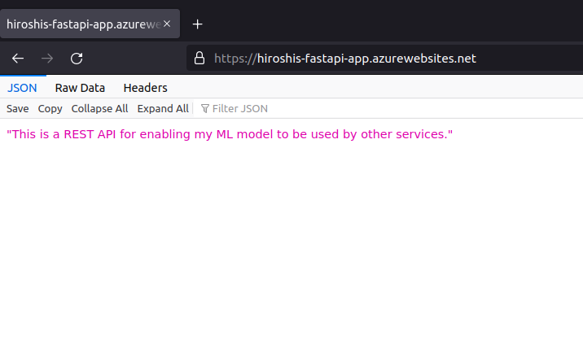

# Example of Deploying a FastAPI App using Azure App Service

An example of how a machine learning model can be served from a REST API using [Azure App Service](https://learn.microsoft.com/en-us/azure/app-service/), a PaaS for hosting web applications.  

### Instructions  
**from the Azure Portal**
1. Fork the [repo](https://github.com/roshmadosh/azure-app-service-fastapi) to your own github account.  
2. From the Azure portal, look up "App Services" on the search bar and navigate to the service.  
3. Click "create"
4. Fill out the first page. 
   - "Runtime stack" should be "Python 3.10"
   - "Pricing plan" must at least be "Basic" or greater
5. On the "Deployment" page, connect to the forked repository on your Github account. 
6. Create the app service.
7. Once created, go to the resource and navigate to the "Configuration" setting.
8. Under the "General Settings" tab, copy and paste `gunicorn main:app --workers 4 --worker-class uvicorn.workers.UvicornWorker --bind 0.0.0.0:8000` into startup command.
9. To redeploy the app, you may have to push a new commit to the Github repo.
10. Go to the "Overview" tab and click on the link under `Default domain`.
11. You should see the following page:

